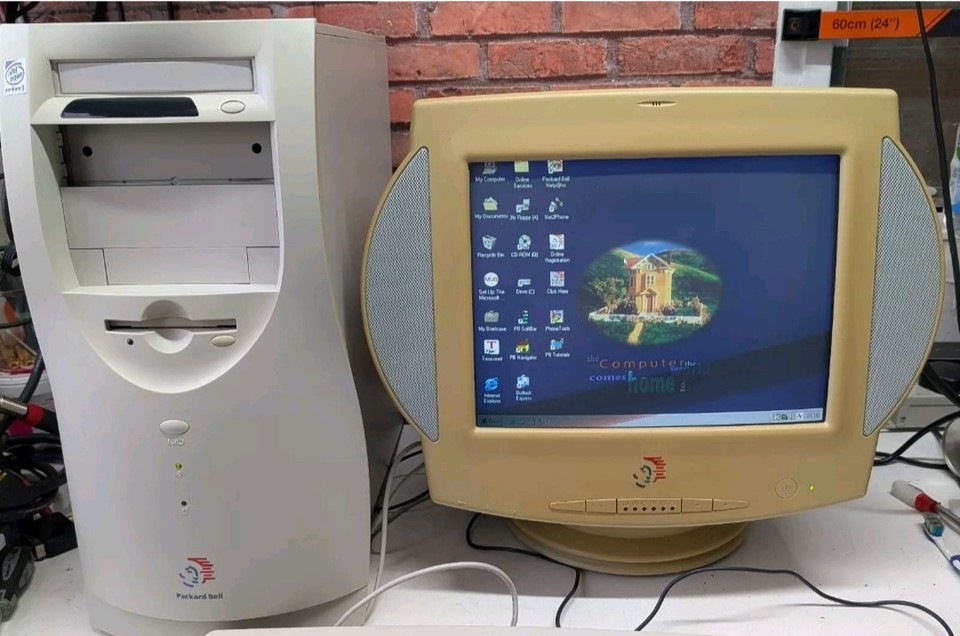
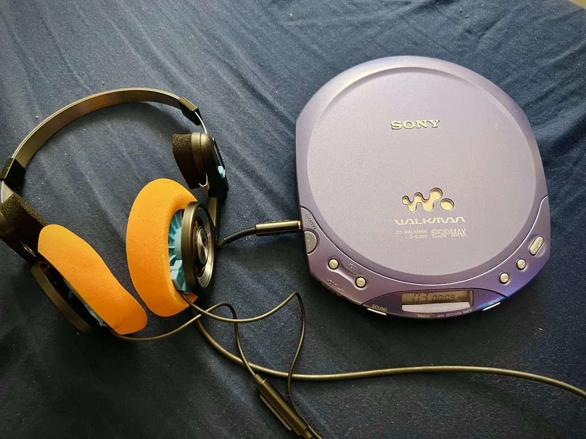
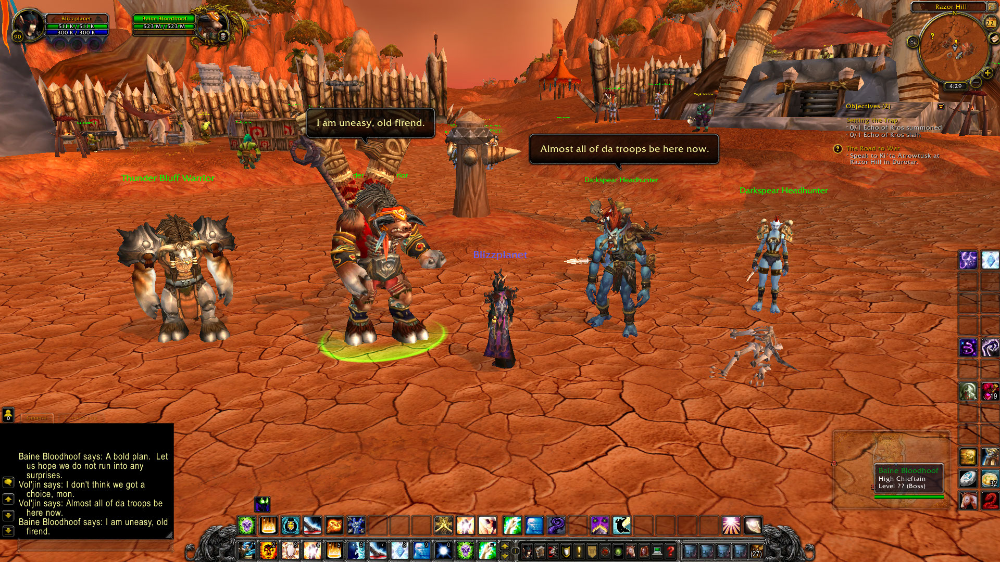
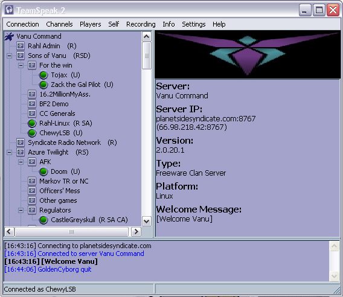

<!--
Lezione 1 — Fondamenta ISO 27001 applicate a reti e cloud
Data: 22/07/2026, 9:00-12:00 (3h)
Fonte: docs/prds/PRD_Corso_Sicurezza_Reti_Cloud.md — sezione 2

Questo deck copre: Apertura, Fondamenta ISO 27001, Attività pratica (risk assessment).
Si ferma volutamente PRIMA del laboratorio Floci: quel blocco (scenario vulnerabile,
istruzioni CLI, hint) va preparato a parte quando arriviamo a quel punto del corso.

Timing indicativo (totale 180 min, di cui 30 fissati nel PRD per l'apertura):
- Apertura: 30 min (fisso da PRD)
- Fondamenta ISO 27001: ~45-50 min
- Attività pratica (risk assessment): ~30-35 min
- Laboratorio Floci: ~60-70 min (da preparare a parte)
-->

# Tecnico per la sicurezza delle reti e dei servizi in cloud

## Lezione 1 — Fondamenta ISO 27001 applicate a reti e cloud

22/07/2026 — 9:00-12:00

**Matteo** Buferli — *Founder Comuni-Chiamo.com*

---

# Chi sono

---

- Matteo Buferli 
- Laurea Triennale in Scienze dell'Informazione a Bologna
- Founder di Comuni-Chiamo.com

---

- Ho cominciato ad usare il pc a 13 anni (ne compio 40 a breve), con un bellissimo Pentium II della Packard Bell, che ho rotto dopo pochi mesi di utilizzo ...

---

---

- Skateboard + walkman + fotocamera usa e getta

---

---

- a 17 anni formo la Gilda italiana più grande su World of Warcraft: era la cosa piu' vicina ai gruppi whatsapp che c'era all'epoca
- parlavamo su un software che si chiamava TeamSpeak, il nonno di Discord / Google Meet o similari

---

---

---

- 2009: mi laurea in scienze dell'informazione a bologna, lavoro quasi 2 anni per Almalaurea
- 2011: fondo **Comuni-Chiamo** — software per la gestione delle segnalazioni dei cittadini, oggi usato da 100+ comuni e 6.500+ operatori
- dal 2016 al 2023: Mentor @ Fondazione Golinelli --- Palestra di imprenditorialità

---

## Comuni-Chiamo (1)

- *The story so far ...*

---

## Comuni-Chiamo (2012 - 2015)

Il mio ruolo nel tempo (1):

- Founder
- Frontend Developer
- Backend Developer
- Mobile Developer

- DevOps
- Software Architect
- System Administrator
- System Integrator

---

## Comuni-Chiamo (2016 - 2020)

Il mio ruolo nel tempo (2):

- Founder
- ~~Frontend Developer~~
- **Design System Engineer**
- Backend Developer
- ~~Mobile Developer~~
- ~~DevOps~~

- Software Architect
- System Administrator
- System Integrator
- **Project Manager**

- **Mentor** @ Fondazione Golinelli (Palestra di imprenditorialità)

---

[ TODO ] foto di golinelli

---

## Comuni-Chiamo (2021 - 2023)

Il mio ruolo nel tempo (3):

- Founder
- **Tech Team Leader** + Project Manager
- Design System Engineer
- Backend Developer
- Project Manager

- Software Architect
- System Administrator
- System Integrator
- **Cloud Specialist (Partner AWS)**

- ~~Mentor~~

---

## Comuni-Chiamo (2023 - --> Today)

Il mio ruolo nel tempo (3):

- Founder
- Tech Team Leader + Project Manager
- Design System Engineer
- Backend Developer
- Project Manager

- Software Architect
- System Administrator
- System Integrator
- Cloud Specialist
- **ISO 9001 / ISO 27001 / NIS2 Specialist**

---

## Comuni-Chiamo (2027)

Nuovi ruoli (?):

- Enterprise AI Architect
- AI Security Engineer 
- Private AI Deployment Specialist

---

## Importante

In questa industria non c'è un unico modo per fare le cose, ma più di uno.

E quello che impariamo, a volte è già obsoleto.

---

## Sharing is caring!

Giro di presentazioni (volontario):

- Nome
- Cosa ti ha portato a questo percorso
- Cosa ti aspetti da queste 9 ore

---

## Come funzionano queste 9 ore

| Data | Orario | Argomento |
|---|---|---|
| 22/07 | 9:00-12:00 | Fondamenta ISO 27001 + Lab |
| 27/07 | 9:00-12:00 | Progettazione teorica di un Cloud complaint + Lavoro di gruppo (1) |
| 29/07 | 9:00-12:00 | Lavorare in gruppo (2) + Discussione finale |

---

# Fondamenta ISO 27001 applicate a reti e cloud

---

## Cos'è un ISMS 
*Information Security Management System*

---

Non è:

- un prodotto
- un firewall
- una soluzione

---

**Information Security Management System**

È un **sistema di gestione**

- Un insieme di politiche, processi e controlli
- Per gestire il rischio sulle informazioni in modo continuo
- Non "sicurezza fatta una volta", ma un ciclo che si ripete

---

## Il ciclo PDCA

**Plan → Do → Check → Act**

| Fase | Cosa significa | Esempio pratico |
|---|---|---|
| **Plan** | Identifico rischi, definisco policy | Rilevo che i backup non sono testati |
| **Do** | Applico i controlli | Introduco test di restore mensili |
| **Check** | Verifico che funzioni | Audit interno sui backup |
| **Act** | Correggo e migliora | Aggiorno la policy di backup |

Il ciclo non finisce mai: si ripete e migliora nel tempo.

---

## Estemporaneo vs strutturato

**Fare sicurezza "a spot"**
- Reagisco quando succede qualcosa
- Nessuna tracciabilità delle decisioni
- Dipende dalla persona, non dal processo

**Gestire la sicurezza con un sistema**
- Rischi identificati e rivalutati nel tempo
- Decisioni documentate e ripetibili
- Sopravvive al turnover delle persone

---

## Perché le aziende adottano ISO 27001 (1)

Non è solo compliance normativa:

- **Gestione concreta del rischio** — sapere cosa può andare storto prima che succeda
- **Credibilità verso clienti e partner** — spesso è un requisito contrattuale
- **Linguaggio comune** — audit, fornitori e clienti parlano lo stesso framework

---

## Perché le aziende adottano ISO 27001 (2.1)

A volte, però è un obbligo:

- **Servizi Cloud, SaaS e IT Vendor (B2B)** — nell'industria cloud, le aziende spesso si affidano a fornitori di servizi
- **Appalti Pubblici e Pubblica Amministrazione (PA)** — in ambito pubblico è sempre più importante averla per operare in tranquillità sul mercato, inoltre è un requisito per la conformità con le normative vigenti (vendita del servizio su MEPA e requisiti NIS di ACN)
- ...

---

## Perché le aziende adottano ISO 27001 (2.2)

- ... **Fintech, Settore Bancario e Assicurativo** — questo settore è regolato da normative severe (come il regolamento europeo DORA - Digital Operational Resilience Act)
- **Sanità e Digital Health (MedTech)** — sviluppano software medici, app di telemedicina o che gestiscono cartelle cliniche elettroniche devono essere certificate
- **Telecomunicazioni e Infrastrutture Critiche** — Ovviamente :)

---

## I controlli Annex A rilevanti per reti e cloud

Quattro aree su cui ci concentriamo oggi:

1. Gestione della sicurezza di rete (8.20)
2. Controllo accessi (8.3)
3. Crittografia (8.24)
4. Sicurezza dei servizi cloud (5.23)

---

## 1. Gestione della sicurezza di rete

- **Segmentazione** — non tutto deve parlare con tutto
- **Monitoraggio** — sapere cosa attraversa la rete
- **Controllo del traffico** — regole esplicite, non "permetti tutto per comodità"

---

## 2. Controllo accessi

- **Autenticazione** — sei davvero chi dici di essere?
- **Autorizzazione** — hai il diritto di fare questa cosa specifica?
- **Minimo privilegio** — solo i permessi strettamente necessari al ruolo

---

## 3. Crittografia

- **Dati a riposo** (at rest) — cosa succede se rubano il disco?
- **Dati in transito** (in transit) — cosa succede se qualcuno intercetta il traffico?
- Non è "attivare un flag": è capire cosa si sta proteggendo e da chi

---

## 4. Sicurezza dei servizi cloud

- **Responsabilità condivisa**: cosa fa il provider, cosa fai tu
- Il provider protegge *il* cloud, tu proteggi *ciò che ci metti dentro*
- Cosa verificare in un contratto cloud: SLA, localizzazione dati, notifica incidenti

---

# Attività pratica

---

## Scenario guidato: migrazione su cloud

Un'azienda deve spostare un servizio interno su cloud (AWS/Azure).

In piccoli gruppi:

1. Identificate gli **asset** coinvolti (dati, sistemi, credenziali)
2. Identificate le **minacce** plausibili
3. Identificate le **vulnerabilità** dello scenario

---

## Ora mettiamo le mani in pasto

Passiamo dal laboratorio "sulla carta" a un ambiente cloud vero (anche se locale e finto):

- **Laboratorio tecnico**
  - Floci 
  - Terraform 
  - AWS Cli
  - Docker

---

## Discussione in plenaria

- Ogni gruppo condivide un pensiero
- Cosa abbiamo imparato?
